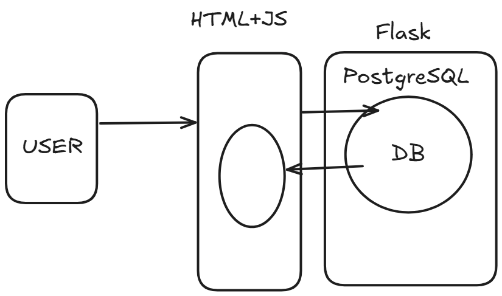
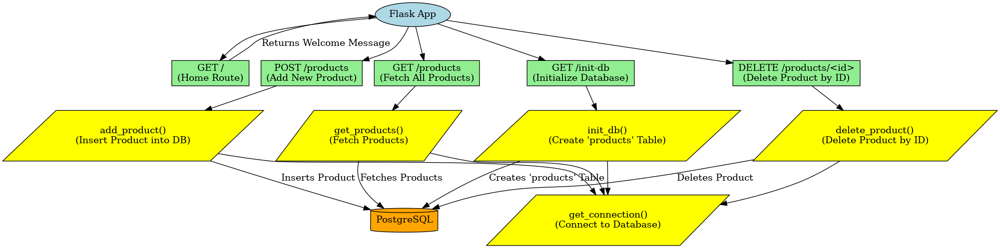
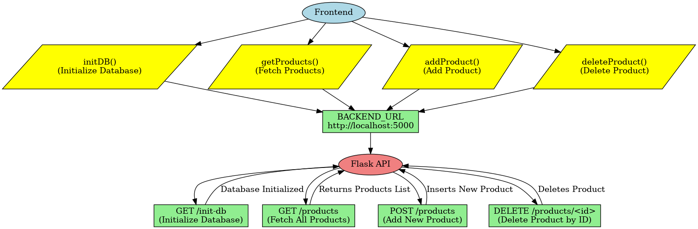
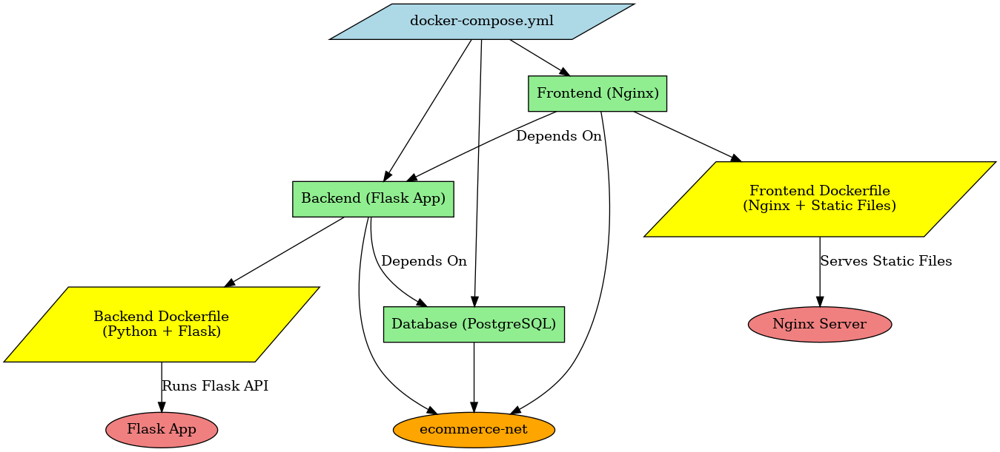

# Create a simple e-commerce from scratch and deploy using docker

# Step 1 : Install Post-gre sql

[https://resagratia.com/resources/blog/how-to-install-postgresql-and-pgadmin](https://resagratia.com/resources/blog/how-to-install-postgresql-and-pgadmin)

# Step 2  : Confirm installation

 psql -U postgres

\l —> to check databases

create database ecommerce_db; 

# Step 3 : Create Back-end Flask app

# Step 4: Create Front-end HTML+JS

# Step 5 : Run Locally

# Step 5 : Containerize it

## Flow-chart

---

### **1. Docker Compose: The Orchestrator**

- `docker-compose.yml` is the configuration file that tells Docker how to build and connect the services.
- It ensures that:
    - **Flask (backend) runs first**.
    - **PostgreSQL (database) is available** before Flask starts.
    - **Nginx (frontend) depends on Flask**, so it waits for the backend before launching.

---

### **2. Backend (Flask) – The API Server**

- Defined in **backend.Dockerfile**.
- Uses **Python (Flask)** to handle API requests.
- It connects to the **PostgreSQL database** to store and retrieve products.
- Exposes **port 5000**, making it accessible to the frontend.

How it works:

1. The Flask app starts and waits for requests.
2. When the frontend sends a request (e.g., "Fetch all products"), Flask queries the database and returns the result.

---

### **3. Database (PostgreSQL) – The Data Store**

- Defined directly in **docker-compose.yml**.
- Stores product information in the **ecommerce_db**.
- Exposes **port 5432**, allowing the backend to access it.

How it works:

1. The backend sends a SQL query (e.g., "SELECT * FROM products").
2. The database responds with the requested data.

---

### **4. Frontend (Nginx) – The User Interface**

- Defined in **frontend.Dockerfile**.
- Uses **Nginx** to serve the static HTML, CSS, and JavaScript files.
- Exposes **port 8080**, allowing users to access the web interface.

How it works:

1. The user visits `http://localhost:8080` in a browser.
2. Nginx serves the frontend files.
3. The frontend makes API calls to `http://localhost:5000` (Flask backend) to fetch and display products.

---

### **5. Communication Between Services**

All three services communicate via **ecommerce-net** (a Docker bridge network), ensuring they can interact without needing external dependencies.

- **Frontend ⟶ Backend (Flask)**
    - `fetch("http://localhost:5000/products")`
    - Flask processes the request and returns product data.
- **Backend (Flask) ⟶ Database (PostgreSQL)**
    - Flask sends `SELECT * FROM products`
    - PostgreSQL responds with stored data.

---

# Step 6 : Run it

 docker-compose up --build -d

# Step 7: Run EC2 via SSH

sudo yum install -y docker

docker -v

 sudo curl -L [https://github.com/docker/compose/releases/latest/download/docker-compose-$](https://github.com/docker/compose/releases/latest/download/docker-compose-$)(uname -s)-$(uname -m) -o /usr/local/bin/docker-compose

sudo chmod +x /usr/local/bin/docker-compose

docker --version
docker-compose --version

# STEP 8 : TRANSFER THE FILES VIA SCP

ls

cd directory_with_pem_file

scp -i "_pem_file_location" -r "_dir_to_send_" [e](mailto:ec2-user@ec2-3-109-157-96.ap-south-1.compute.amazonaws.com)c2_location:~/

# STEP 8 : Build Docker

 docker-compose up --build -d

# H/W

1. Is there a better way to do it ?
2. How to visualize the front-end ?
